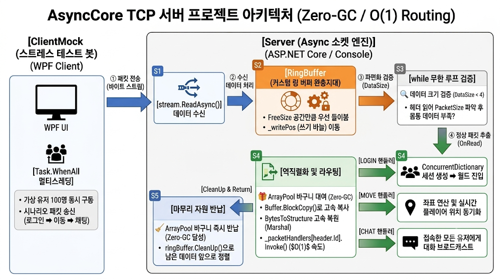

# AsyncCore-TCP-Server
Low-Level 최적화와 모듈화 구조
> **Low-Level 최적화와 모듈화 구조를 적용한 고성능 비동기 게임 서버 엔진**

C# `async/await` 비동기 소켓 통신을 기반으로, 가비지 컬렉터(GC) 부하를 최소화하는 **Zero-GC 최적화**와 `Dictionary` 기반의 **$O(1)$ 패킷 핸들러 매핑 구조**, 그리고 TCP 파편화를 방어하는 **커스텀 링 버퍼(Ring Buffer)**를 구현한 멀티스레드 게임 서버 인프라입니다.

---

## 🏗️ 솔루션 아키텍처 및 모듈 구조

본 프로젝트는 고성능 유지보수와 책임을 명확히 분리하기 위해 아래와 같이 **3개 모듈로 구조화**되어 있습니다.

* **Server (C# 콘솔 앱)**: 패킷 수신, 링 버퍼 검증, 역직렬화, 메모리 풀링 및 컨텐츠 비즈니스 로직을 처리하는 핵심 서버 모듈
* **ClientMock (C# 콘솔 앱)**: `Task.WhenAll`을 활용해 가상 유저 100명이 동시에 시나리오(로그인 ➡️ 이동 ➡️ 채팅)대로 동작하도록 설계된 고동시성 스트레스 테스트 봇
* **Common (클래스 라이브러리)**: 서버와 클라이언트가 명세를 공유하는 C++ 스타일의 고정 크기 패킷 구조체 정의 및 링 버퍼 레이어

---

## 🚀 핵심 기술 및 로우레벨 최적화 포인트

### 1. 고정 크기 구조체 마샬링을 통한 C++ 스타일 직렬화/역직렬화
* **`StructLayout` 제어**: 서버와 클라이언트 간 주고받는 패킷의 메모리 오프셋 규격을 완벽하게 일치시키기 위해 세밀한 바이트 패킹(`Pack = 1`)을 적용했습니다.
* **고속 마샬링**: 가비지(GC)를 대량 유발하는 JSON/XML 방식 대신, `Marshal.StructureToBytes` 및 `Marshal.PtrToStructure`를 활용해 스택 메모리 공간에 바이트 배열을 그대로 복사해 넣는 방식을 채택하여 최상의 연산 속도를 달성했습니다.

### 2. 가비지 컬렉터(GC) 부하 차단을 위한 Zero-GC 빌드업
* **ArrayPool 메모리 풀링**: 대규모 동시 요청 시 힙(Heap) 메모리 영역에 버퍼가 난사되어 발생하는 GC 참조 추적 부하를 제거했습니다. `.NET ArrayPool<byte>.Shared`를 도입해 버퍼를 대여 및 반납하는 렌탈 구조를 구축했습니다.
* **`Buffer.BlockCopy` 활용**: 흩어져 수신된 버퍼를 조립할 때 속도가 느린 루프문 대신 CPU 레벨에서 가장 빠르게 연산하는 메모리 블록 고속 복사를 사용하여 성능 최적화를 꾀했습니다.

### 3. $O(1)$ 스케일의 패킷 핸들러 딕셔너리 매핑
* 패킷 종류 확장에 취약한 `if-else` 나 `switch-case` 분기문을 완전히 걷어냈습니다.
* `Dictionary<ushort, Action<byte[]>>` 시스템에 패킷 ID와 처리 함수를 1:1로 매핑하여, 패킷이 수백 개로 늘어나도 조건문 없이 **$O(1)$의 고정 속도**로 컨텐츠 로직에 즉시 바인딩되는 구조를 완성했습니다.

### 4. 커스텀 패킷 링 버퍼(Ring Buffer)를 통한 TCP 파편화 방어
* 데이터의 경계가 없는 TCP 스트림 통신의 특성상 발생하는 패킷 쪼개짐(Fragmentation) 및 뭉침(Coalescing) 현상을 방기하기 위해 전용 완충지대인 `RingBuffer`를 직접 구현했습니다.
* 유입되는 바이트 스트림을 누적하고 패킷 헤더에 명시된 크기만큼 정밀하게 슬라이싱(`OnRead`)해내는 구조를 구축하였으며, `CleanUp`을 통해 메모리 선형 정렬 최적화를 완료했습니다.

---

## 📈 프로젝트 성장 스토리라인

- [1단계: 기초 엔진] TCP Socket 기반의 비동기(async/await) 통신 뼈대 구축
👇
- [2단계: 역직렬화] C++ 스타일의 고정 크기 구조체와 마샬링(Marshal)을 이용한 커스텀 패킷 설계
👇
- [3단계: 최적화] 대규모 패킷 수신 시 GC 부하를 없애기 위한 .NET ArrayPool 메모리 풀링 도입
👇
- [4단계: 구조화] 패킷 ID에 따라 O(1)로 분기하는 Dictionary 기반 패킷 핸들러 매핑 구조 완성
👇
- [5단계: 인프라] TCP 패킷 뭉침/쪼개짐을 원천 차단하는 커스텀 패킷 링 버퍼(Ring Buffer) 구현
👇
- [6단계: 검증] 가상 유저 100인의 초고동시성 시나리오(로그인 ➡️ 이동 ➡️ 브로드캐스트 채팅) 스트레스 테스트 대성공

- 

[ ClientMock (스트레스 테스트 봇) ]
   - 가상 유저 100명 동시 구동 (Task.WhenAll)
   - 시나리오 패킷 송신 (로그인 ➡️ 이동 ➡️ 채팅)
         │
         │  (인터넷 선로: 연속된 바이트 스트림 데이터 전송)
         ▼
[ Server (Async 소켓 엔진) ] ── stream.ReadAsync()로 데이터 수신
         │
         ▼  [1단계: 임시 통장 기록]
┌────────────────────────────────────────────────────────┐
│  ▶ RingBuffer (커스텀 링 버퍼 완충지대)                │
│  - FreeSize 공간만큼 우선 들이붊                       │
│  - _writePos (쓰기 바늘) 이동                          │
└────────────────────────────────────────────────────────┘
         │
         ▼  [2단계: 패킷 쪼개짐/뭉침 필터링 (while 무한 루프)]
┌────────────────────────────────────────────────────────┐
│  🔍 링 버퍼 데이터 크기 검증 (DataSize)               │
│  - 최소 헤더 크기(4바이트) 미만? ➡️ break (더 기다림)   │
│  - 헤더 읽어서 PacketSize 파악 후, 몸통 데이터 부족?   │
│    ➡️ break (몸통 덜 왔으니 다음 데이터 더 기다림)    │
└────────────────────────────────────────────────────────┘
         │
         ▼  [3단계: 패킷 컷팅 완료 (정상 패킷 추출)]
┌────────────────────────────────────────────────────────┐
│  🎁 ArrayPool<byte>.Shared.Rent(PacketSize)            │
│  - 가비지를 남기지 않기 위해 메모리 풀에서 바구니 대여  │
│  - Buffer.BlockCopy()로 데이터 고속 복사               │
│  - ringBuffer.OnRead() 읽기 바늘 전진                  │
└────────────────────────────────────────────────────────┘
         │
         ▼  [4단계: 구조체 복원 및 라우팅]
┌────────────────────────────────────────────────────────┐
│  ⚙️ 로우레벨 역직렬화 및 핸들러 분기                  │
│  - BytesToStructure (Marshal.PtrToStructure) 고속 복원 │
│  - _packetHandlers[header.Id].Invoke() ── $O(1)$ 속도로 │
│    조건문 없이 담당 함수로 즉시 토스!                 │
└────────────────────────────────────────────────────────┘
         │
         ├───▶ [LOGIN 핸들러]: ConcurrentDictionary 세션 생성 ➡️ 월드 진입
         ├───▶ [MOVE 핸들러]: 좌표 연산 및 실시간 플레이어 위치 동기화
         └───▶ [CHAT 핸들러]: 접속한 모든 유저에게 대화 브로드캐스트
         │
         ▼  [5단계: 마무리 자원 반납]
┌────────────────────────────────────────────────────────┐
│  🧹 CleanUp & Return                                   │
│  - ArrayPool 바구니 즉시 반납 (Zero-GC 달성)           │
│  - ringBuffer.CleanUp()으로 남은 데이터 앞으로 정렬    │
└────────────────────────────────────────────────────────┘

