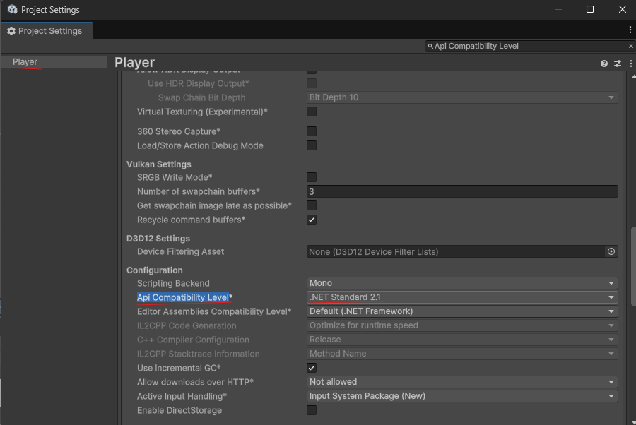
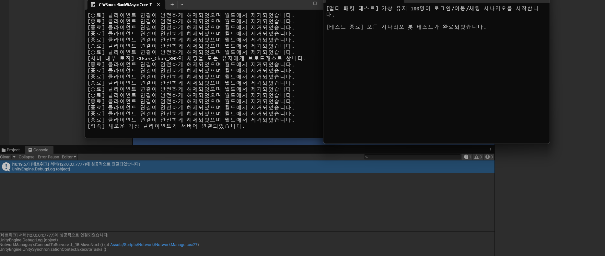
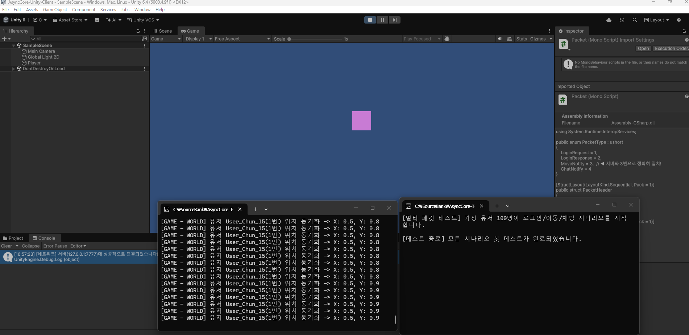
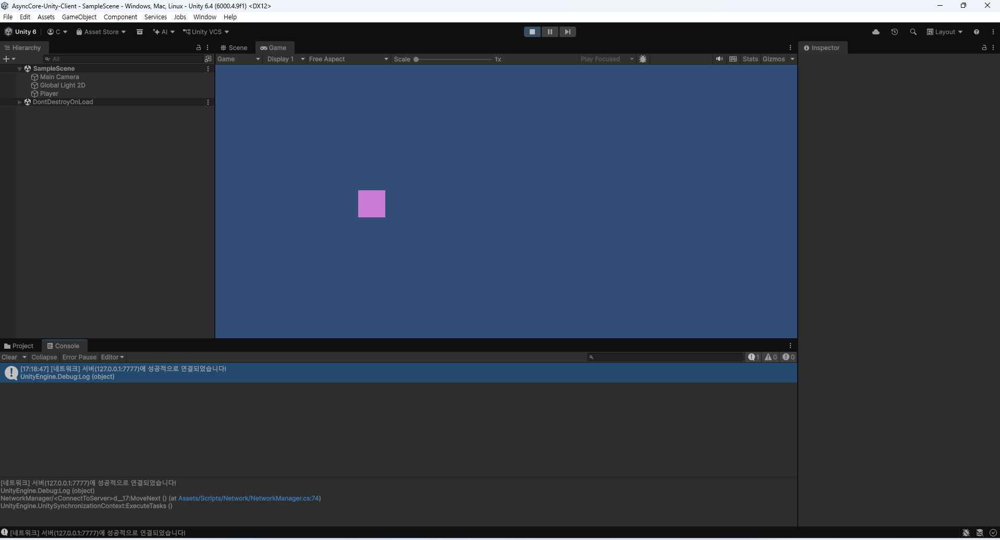
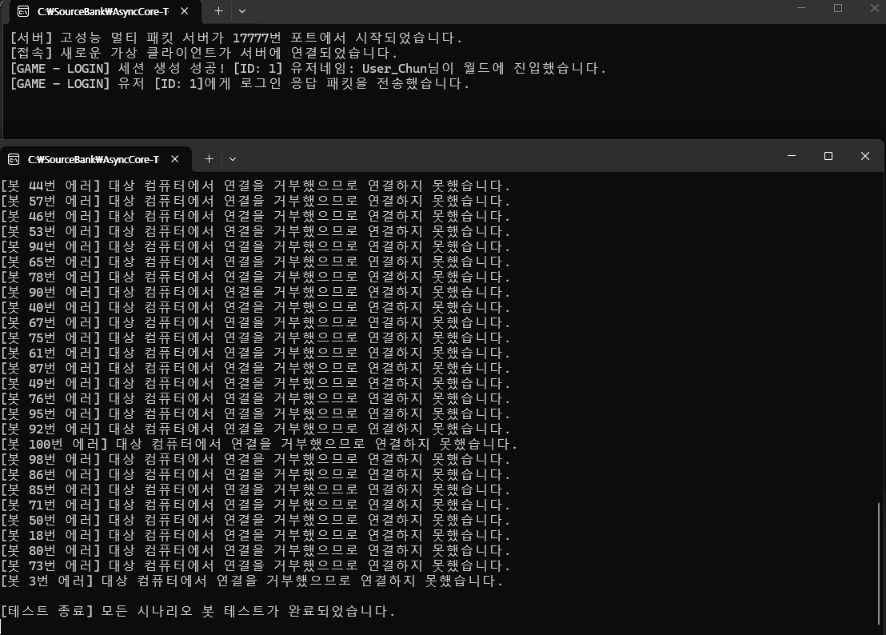
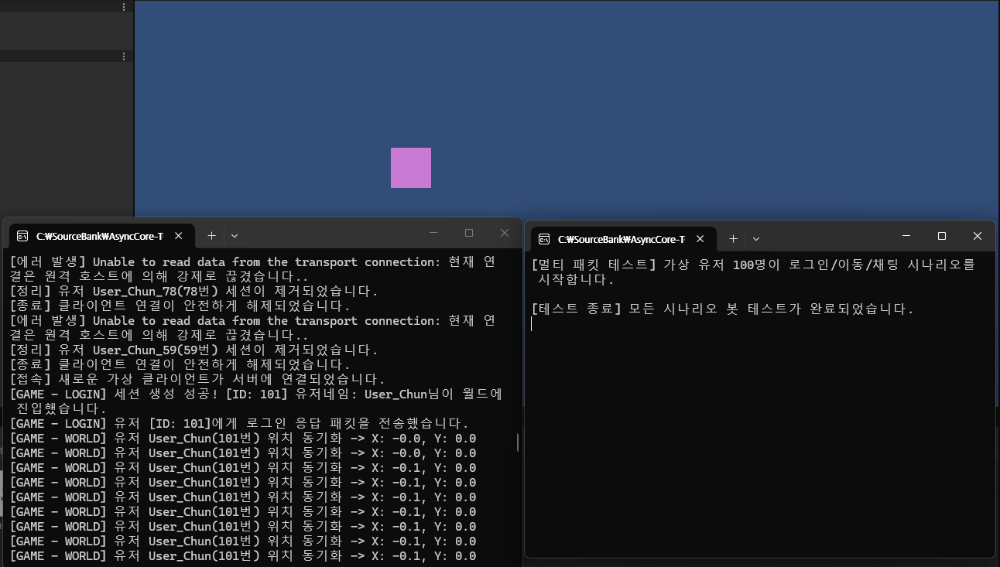

# AsyncCore-TCP-Server

> **Low-Level 최적화와 모듈화 구조를 적용한 고성능 비동기 게임 서버 엔진**

C# `async/await` 비동기 소켓 통신을 기반으로, 가비지 컬렉터(GC) 부하를 최소화하는 **Zero-GC 최적화**와 `Dictionary` 기반의 **O(1) 패킷 핸들러 매핑**, TCP 파편화를 방어하는 **커스텀 링 버퍼(Ring Buffer)**를 구현한 멀티스레드 게임 서버 인프라입니다.

---

## 🏗️ 솔루션 아키텍처

책임을 명확히 분리하기 위해 3개 모듈로 구조화했습니다.

| 모듈 | 역할 |
|---|---|
| **Server** (C# 콘솔 앱) | 비동기 패킷 수신·역직렬화, 메모리 풀링, 컨텐츠 로직을 담당하는 핵심 엔진 |
| **ClientMock** (C# 콘솔 앱) | `Task.WhenAll` 기반 고동시성 스트레스 테스트 봇 (가상 유저 100명, 로그인→이동→채팅 시나리오) |
| **Unity Client** | 고정 크기 구조체 마샬링을 통한 서버와의 실시간 좌표 동기화 |
| **Common** (클래스 라이브러리) | 서버-클라이언트가 공유하는 패킷 구조체 명세 |

---

## 🚀 핵심 기술 및 최적화 포인트

| 최적화 분야 | 기술 스택 / 기법 | 달성 효과 |
|---|---|---|
| 통신 인프라 | TCP Socket + `async/await` | 스레드 낭비 없는 고동시성 처리 |
| 직렬화 | `StructLayout(Pack=1)` + `Marshal` | C++ 수준의 로우레벨 고속 직렬화 |
| 메모리 최적화 | `.NET ArrayPool<byte>` | 힙 할당 최소화 (Zero-GC) |
| 패킷 라우팅 | `Dictionary<ushort, Action<byte[]>>` | O(1) 시간 복잡도 핸들링 |
| 스트림 제어 | 커스텀 링 버퍼 | TCP 뭉침/쪼개짐(Fragmentation) 방어 |
| 동시성 관리 | `ConcurrentDictionary` | 멀티스레드 세션 데이터 안전 관리 |

---

## 📈 프로젝트 성장 스토리라인

1. **엔진 기초** — 비동기 소켓 통신 및 패킷 헤더 구조체 설계
2. **Zero-GC** — `ArrayPool`과 `Buffer.BlockCopy`로 GC 부하 원천 차단
3. **인프라 고도화** — TCP 파편화/뭉침 현상을 방어하는 커스텀 링 버퍼 구현
4. **아키텍처 최적화** — O(1) 패킷 핸들러 매핑 시스템 구축
5. **시뮬레이션** — 가상 유저 100인 동시성 시나리오 스트레스 테스트 통과
6. **클라이언트 연동** — Unity와 서버 간 실시간 위치 동기화(MoveNotify) 완료

---

## 🔍 TCP 파편화 문제와 해결

TCP는 스트림 프로토콜이라 "보낸 만큼 정확히 나눠서 도착"을 보장하지 않습니다. 두 가지 문제가 발생할 수 있습니다.

- **쪼개짐(Fragmentation)**: 16바이트짜리 패킷을 한 번에 보내도, 앞부분 10바이트만 먼저 도착하고 나머지 6바이트는 뒤늦게 도착할 수 있음
- **뭉침(Coalescing)**: 패킷 3개를 연속으로 빠르게 보내면, 48바이트가 한 번에 뭉쳐서 도착할 수 있음

**해결책**: 수신 데이터를 링 버퍼에 일단 모두 쌓아두고, `(1) 헤더 4바이트가 다 모였는지 → (2) 헤더에 적힌 전체 패킷 크기만큼 몸통이 다 모였는지`를 순서대로 검증한 뒤, 조건이 충족된 만큼만 정확히 잘라내어 핸들러로 전달합니다. 남은 데이터는 버퍼에 그대로 유지되어 다음 수신 때 이어붙습니다.

---

## 💬 확장성에 대한 고찰

**Q. 100명이 아니라 10,000명이 접속하면 지금 구조(`Task.Run`으로 커넥션마다 태스크 하나)로 버틸 수 있나요?**

지금 구조는 유저 한 명당 하나의 비동기 흐름을 배정하는 방식이라, 접속자가 매우 많아지면 컨텍스트 전환 비용이 커질 수 있습니다. 다음 단계로는 하나(혹은 소수)의 스레드가 수천 개의 네트워크 이벤트를 감시·처리하는 **IOCP(I/O Completion Port)** 구조나, C#의 고성능 네트워크 파이프라인인 **`System.IO.Pipelines`**로 전환하는 방향을 고려할 수 있습니다.

---

## 🎮 개발 성과

- 유니티 클라이언트에서 보낸 이동 패킷을 서버가 수신·처리하고, 결과를 서버 로그 및 유니티 화면에 실시간 반영
- 가상 유저 100명이 월드에 접속해 이동·채팅하는 스트레스 테스트로 엔진 안정성 검증

C# 콘솔 서버 창에 [접속] 새로운 가상 클라이언트가 서버에 연결되었습니다.가 딱 뜨면서 유니티 콘솔창에도 파란색 체크로 성공

player를 이동을해서 서버에 값 전달 성공

로그인 아이디를 받기 성공

로그인된 아이디에서 이동값 불러오기 성공

