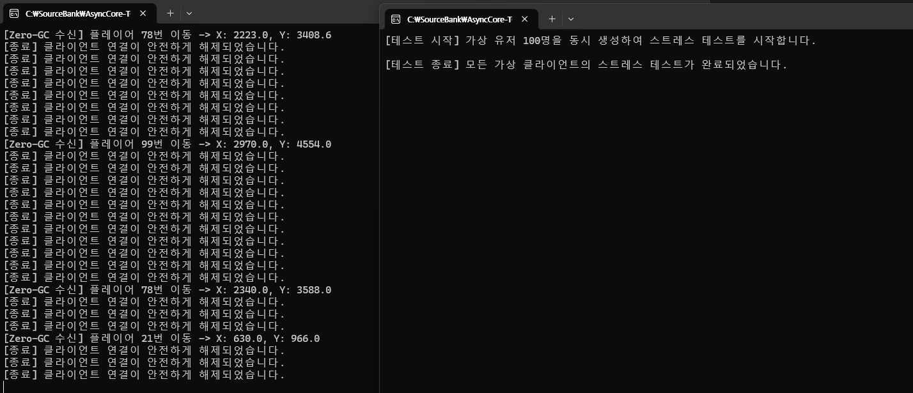

2. 내가 이해하기 쉬운 면접 대비 핵심 노트

1. 데이터 정의 및 전송 (직렬화)
      - 구조체(Struct) : 연관된 데이터들을 하나로 깔끔하게 묶어주는 '종이봉지'
      - StructLayout 속성 : 서버와 클라이언트가 주고받는 봉지 속 내용물의 위치를 칼같이 맞춰서 '누가 열어도 똑같은 위치에 내용물이 있게 만드는 메모리 규격 자석'
      - StructureToBytes (마샬링 직렬화) : 무거운 텍스트(JSON)로 바꾸는 대신, 구조체 봉지 그대로 모양 변형 없이 고속으로 압축 팩에 넣어 바이트 배열로 구워 보내는 '포인터 연산 급의 초고속 압축기'

2. 수신 엔진 및 연산 (비동기 & 역직렬화)
      - async / await 비동기 문법 : 클라이언트가 쉴 때 서버 일꾼(스레드)이 같이 멍 때리고 서 있는 게 아니라, 다른 유저 패킷을 처리하러 가게 만드는 '서버 자원 극대화용 멀티태스킹 지침서
      - 운송장(4바이트) 먼저 읽기 : 무식하게 택배를 다 뜯지 않고 딱 앞부분의 4바이트(PacketHeader)만 콕 집어서 진짜 내용물 크기를 안전하게 파악하는 '지능형 영수증 스캔'
      - BytesToStructure (마샬링 역직렬화) : 날아온 바이트 압축 팩을 가비지(쓰레기) 없이 메모리에 그대로 촤악 펼쳐서 원래 구조체 봉지로 완벽 복원하는 'Zero-GC용 3D 스냅샷 찍기'
      - Buffer.BlockCopy : 버퍼들을 합칠 때 하나씩 손으로 옮기는(for문) 게 아니라 포크레인으로 메모리 블록을 한 번에 떠서 고속 복사하는 '하드웨어 레벨의 성능 쥐어짜기'

3. 고급 구조 및 인프라 (핸들러 & 링 버퍼)
      - _packetHandlers (딕셔너리 매핑) : 패킷 종류가 100개로 늘어났을 때 if문으로 1번부터 100번까지 검사하는 게 아니라, 단축 번호(패킷 ID)만 보고 담당 부서 함수로 0.00001초 만에 바로 직통 연결해 주는 '하이패스 전화 교환기'

      - ConcurrentDictionary (세션 보관소) : 100명의 유저가 동시에 접속해서 메모리에 데이터를 쓰고 지울 때, 일꾼 스레드들이 엉켜서 서버가 터지지 않게 줄을 세워주는 '보안요원이 지키는 멀티스레드 세이프 보관함'

      - RingBuffer (패킷 링 버퍼) : 인터넷 선로에서 패킷이 쪼개져 오거나 여러 개가 한 번에 뭉쳐서 와도, 일단 통장에 다 저축해 두고 정해진 패킷 크기만큼 가위로 칼같이 잘라내 주는 'TCP 파편화 현상 전용 방어막'

      - 가비지 컬렉터(GC) : 힙(Heap) 메모리 방에 주인을 잃은 쓰레기가 쌓이면 돌아가는 '자동 청소 로봇'. 하지만 청소할 때 서버를 얼려버리는 단점(Stop-The-World)이 있어, 우리는 ArrayPool로 메모리를 대여/반납하여 쓰레기를 원천 차단하는 Zero-GC 최적화를 달성함.

## 🚀 핵심 기술 및 로우레벨 최적화 포인트

### 1. 고정 크기 구조체 마샬링을 통한 C++ 스타일 역직렬화
* **`StructLayout` 제어**: 서버와 클라이언트 간 주고받는 패킷의 메모리 오프셋 규격을 완벽하게 일치시키기 위해 세밀한 바이트 패킹(`Pack = 1`)을 적용했습니다.
* **고속 직렬화 / 역직렬화**: 가비지(GC)를 대량 유발하는 JSON/XML 방식 대신, `Marshal.PtrToStructure` 및 스택 메모리 복사 기법을 사용했습니다. 포인터 연산 수준의 고속 패킷 복원을 달성하여 CPU 연산 효율을 극대화했습니다.

### 2. 가비지 컬렉터(GC) 부하 차단을 위한 Zero-GC 빌드업
* **ArrayPool 메모리 풀링**: 대규모 동시 요청 시 힙(Heap) 메모리 영역에 버퍼가 난사되어 발생하는 GC 참조 추적 부하를 제거했습니다. `.NET ArrayPool<byte>.Shared`를 도입해 버퍼를 대여 및 반납하는 렌탈 구조를 구축했습니다.
* **`Buffer.BlockCopy` 활용**: 분할 수신된 헤더와 바디 버퍼를 조립할 때 루프 문 대신 CPU 레벨에서 가장 빠르게 연산하는 메모리 블록 고속 복사를 사용하여 나노초 단위의 성능까지 쥐어짜냈습니다.

### 3. $O(1)$ 스케일의 패킷 핸들러 딕셔너리 매핑
* 패킷 종류 확장에 취약한 `if-else` 나 `switch-case` 분기문을 완전히 걷어냈습니다.
* 서버 시작 시 `Dictionary<ushort, Action<byte[]>>` 시스템에 패킷 ID와 처리 함수를 1:1로 매핑하여, 패킷이 수백 개로 늘어나도 조건문 없이 **$O(1)$의 고정 속도**로 컨텐츠 로직에 즉시 바인딩되는 구조를 완성했습니다.

### 4. 멀티스레드 동시성 제어 및 게임 세션 연동
* 100명의 가상 유저가 동시다발적으로 메모리에 접근하는 환경에서 데이터가 오염되는 경쟁 조건(Race Condition)을 방어하기 위해 내부 장벽이 세워진 **`ConcurrentDictionary`**를 도입했습니다.
* 이를 통해 유저의 로그인 정보, 실시간 위치 좌표(`PosX`, `PosY`), 월드 채팅 정보를 락(Lock) 프리 구조에 준하게 안전하게 보동기화하고 관리합니다.

---

## 📈 프로젝트 성장 스토리라인

[1단계: 기초 엔진] TCP Socket 기반의 비동기(async/await) 통신 뼈대 구축
👇
[2단계: 역직렬화] C++ 스타일의 고정 크기 구조체와 마샬링(Marshal)을 이용한 커스텀 패킷 설계
👇
[3단계: 최적화] 대규모 패킷 수신 시 GC 부하를 없애기 위한 .NET ArrayPool 메모리 풀링 도입
👇
[4단계: 구조화] 패킷 ID에 따라 O(1)로 분기하는 Dictionary 기반 패킷 핸들러 매핑 구조 완성
👇
[5단계: 검증] Task.WhenAll을 활용한 100인 가상 유저 동시성/다중 패킷 시나리오 스트레스 테스트 통과

Visual Studio를 켜고 아래 구조로 솔루션을 생성해 보세요:

Server (C# 콘솔 앱): 패킷을 받고 연산하는 핵심 서버 모듈

ClientMock (C# 콘솔 앱): 유저 100명이 동시에 접속하는 것처럼 패킷을 마구 쏘아 보내는 서버 테스트용 프로그램 (스트레스 테스트용)

Common (클래스 라이브러리): 서버와 클라이언트가 같이 사용할 패킷 구조체 정의 (struct Packet)

- 구조체 : 연관된 데이터들을 하나로 묶는 봉지

- StructLayout 속성을 사용한 이유는 서버와 클라이언트 간에 주고받는 패킷 데이터의 메모리 규격을 완벽하게 일치시키기 위해서

- async/await 비동기 문법: 서버의 자원(스레드) 효율을 극대화하여 대규모 접속자를 효율적으로 처리하기 위해서

- StructureToBytes 함수:C++ 스타일의 로우 레벨 최적화 기법 Marshal(마샬링) 라이브러리를 사용해 구조체가 담긴 스택 메모리를 그대로 복사해서 바이트 배열로 구워 보냈습니다. C++의 포인터 연산만큼 빠르고 패킷 크기도 최소화

1. 운송장(4바이트)만 먼저 읽기 : 서버는 무식하게 전체 데이터를 한 번에 가져오지 않았습니다. 우리가 설계한 대로 딱 앞부분의 4바이트(PacketHeader)만 콕 집어서 안전하게 먼저 불러왔습니다.

2. 쉬어가며 불러오기 : 클라이언트가 1초 쉴 때 서버도 굳어서 멈춰 있는 게 아니라, 데이터를 보내오는 순간에만 슥 깨어나서 "불러오기 완료!"를 외치고 다시 대기 상태로 들어갔습니다.

- 바이트 배열로 변환되어 날아온 패킷을 다시 우리가 쓸 수 있는 구조체 모양으로 돌리는 과정을 '역직렬화' 또는 '마샬링(Unmarshalling)'

- BytesToStructure 기법 (마샬링)
    - "C#의 일반적인 직렬화 방식(JSON 등)은 무겁고 가비지(GC)를 유발하지만, 저는 Marshal.PtrToStructure를 이용해 네트워크로 수신한 바이트 배열을 C++ 스타일로 메모리 공간에 그대로 복사해 넣은 뒤 구조체로 찍어냈습니다."

- Buffer.BlockCopy 활용:
    - 따로 흩어져서 수신된 헤더 버퍼와 바디 버퍼를 합칠 때, 속도가 느린 반복문 방식 대신 CPU가 가장 빠르게 연산할 수 있는 메모리 블록 고속 복사(Buffer.BlockCopy)를 사용하여 성능 최적화를 꾀했습니다."

- 패킷 설계(Common), 비동기 수신 엔진(Server), 스트레스 테스트 봇(ClientMock)까지 이어지는 핵심 통신 뼈대가 완벽하게 구동

- 가비지 컬렉터(GC): 자동 청소
    
    1. 힙(Heap) 메모리 관리 : GC는 데이터가 동적으로 할당되는 힙(Heap) 메모리 영역 전담하여 청소

    2. 루트(Root)에서부터의 참조 추적: '참조(연결고리)'를 추적: 코드의 출발점(Root)에서부터 이 데이터까지 이어지는 연결고리가 끊어졌다면, 더 이상 접근할 수 없는 '가비지(쓰레기)'로 판단하고 수거 대상에 포함

### 비동기 + Zero-GC 엔진이 100인 대규모 동시성 스트레스 테스트

### "TCP 패킷 뭉침/쪼개짐 현상(TCP Fragmentation)은 어떻게 해결하셨나요?

- 패킷 링 버퍼(Ring Buffer) 혹은 스트림 버퍼를 직접 구현해서 데이터가 뭉쳐오든 쪼개오든 딱 패킷 크기만큼만 가위로 자르듯 예쁘게 잘라내는 인프라를 장착해야 합니다.

### 100명이 아니라 10,000명이 오면 Task.Run 방식으로 버틸 수 있나요?"

- 해결책 (업그레이드 2): 유저 한 명당 일꾼 하나를 붙이는 게 아니라, 상태(State)를 관리하며 하나의 스레드가 수천 명의 네트워크 이벤트를 고속으로 감시하고 처리하는 IOCP(Input/Output Completion Port) 구조나 C#의 System.IO.Pipelines 고성능 네트워크 파이프라인으로 전환하는 것입니다.

[1단계: 기초 엔진] TCP Socket 기반의 비동기(async/await) 통신 뼈대 구축
      👇
[2단계: 역직렬화] C++ 스타일의 고정 크기 구조체와 마샬링(Marshal)을 이용한 커스텀 패킷 설계
      👇
[3단계: 최적화] 대규모 패킷 수신 시 GC 부하를 없애기 위한 .NET ArrayPool 메모리 풀링 도입
      👇
[4단계: 구조화] 패킷 ID에 따라 O(1)로 분기하는 Dictionary 기반 패킷 핸들러 매핑 구조 완성
      👇
[5단계: 검증] Task.WhenAll을 활용한 100인 가상 유저 동시성/다중 패킷 시나리오 스트레스 테스트 통과

# AsyncCore-TCP-Server
> **Low-Level 최적화와 모듈화 구조를 적용한 고성능 비동기 게임 서버 엔진**

C# `async/await` 비동기 소켓 통신을 기반으로, 가비지 컬렉터(GC) 부하를 최소화하는 **Zero-GC 최적화**와 `Dictionary` 기반의 **$O(1)$ 패킷 핸들러 매핑 구조**를 구현한 멀티스레드 게임 서버 인프라입니다. 

---

## 🏗️ 솔루션 아키텍처 및 모듈 구조

본 프로젝트는 고성능 유지보수와 책임을 명확히 분리하기 위해 아래와 같이 **3개 모듈로 구조화**되어 있습니다.

* **Server (C# 콘솔 앱)**: 패킷 수신, 역직렬화, 메모리 풀링 및 컨텐츠 비즈니스 로직을 처리하는 핵심 서버 모듈
* **ClientMock (C# 콘솔 앱)**: `Task.WhenAll`을 활용해 가상 유저 100명이 동시에 시나리오(로그인 ➡️ 이동 ➡️ 채팅)대로 동작하도록 설계된 고동시성 스트레스 테스트 봇
* **Common (클래스 라이브러리)**: 서버와 클라이언트가 명세를 공유하는 C++ 스타일의 고정 크기 패킷 구조체 정의 레이어

---

패킷 쪼개짐 (Fragmentation): 클라이언트는 분명히 16바이트(MovePacket)를 한 번에 쐈는데, 인터넷선이 팅겨서 서버에는 앞부분 10바이트만 먼저 도착하고 나머지 6바이트는 0.5초 뒤에 도착할 수 있습니다

    - 현재 서버의 문제점:지금 코드는 ReadAsync(headerBuffer, 0, 4)로 4바이트를 '무조건' 다 읽었다고 가정합니다. 만약 데이터가 쪼개져서 2바이트만 먼저 오면? 헤더가 깨지면서 서버가 터집니다.

패킷 뭉침 (Coalescing):

    - 클라이언트가 이동 패킷 3개를 연속으로 빠르게 쐈는데, 네트워크 선로에서 밀려있다가 서버에 48바이트(16바이트 $\times$ 3개)가 한 번에 와르르 쏟아질 수 있습니다.
    - 현재 서버의 문제점: 지금 코드는 한 번 읽을 때 패킷 딱 하나만 들어왔다고 가정하기 때문에, 뭉쳐서 들어오면 뒤에 붙어온 2개 패킷은 그냥 씹히거나 버려집니다.

[인터넷선] ➡️ 뭉쳐오든 쪼개오든 일단 '임시 통장(버퍼)'에 다 들이부음 (기록 포인터 이동)
      👇
[서버 엔진] ➡️ "통장에 돈(바이트)이 최소 4바이트(헤더 크기) 이상 모였나?" 체크
      👇
[서버 엔진] ➡️ 모였다면 헤더를 슬쩍 읽어서 "총 패킷 크기(예: 16바이트)" 확인
      👇
[서버 엔진] ➡️ "통장에 진짜 16바이트 이상 쌓였나?" 확인 후, 쌓였다면 딱 16바이트만 가위로 슥 잘라서 핸들러로 토스! (읽기 포인터 이동)